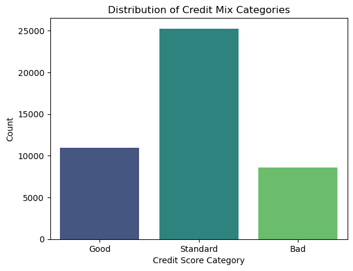
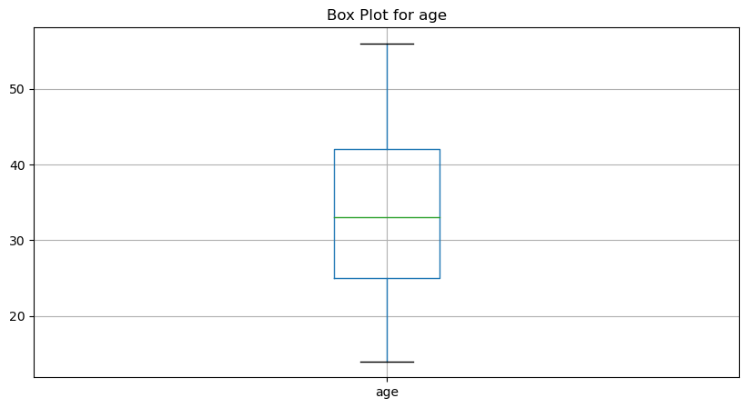
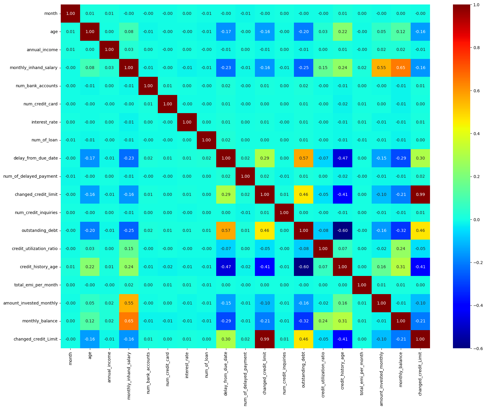

# Credit Score Classification Using ML

## Project Overview
This project involves classifying credit scores using machine learning. The project includes data analysis, visualization, model training, and evaluation to predict credit scores accurately. The dataset consists of 50,000 rows and 27 columns.

## Technologies Used

## Project Details

### Exploratory Data Analysis and Data Preprocessing
- **Performed exploratory data analysis (EDA) and data preprocessing** on a dataset with 50,000 rows and 27 columns using Python libraries such as NumPy and Pandas.
- Visualized data trends and patterns by creating count plots, boxplots, and heatmaps using Seaborn and Matplotlib, enhancing insights into data distribution and relationships.

### Visualization
- **Count Plot:** Displays the count of observations in each categorical bin using bars.
   <!-- Replace with your actual image path -->
- **Boxplot:** Displays the distribution of data based on a five-number summary.
   <!-- Replace with your actual image path -->
- **Heatmap:** Displays data values in a matrix form with varying colors.
   <!-- Replace with your actual image path -->

### Model Training and Evaluation
- Trained and evaluated multiple classification models, achieving the following accuracies:
  - **Decision Tree:** 78%
  - **Random Forest:** 86%
  - **K-Nearest Neighbors (KNN):** 66%
- Assessed model performance using accuracy, precision, recall, and F1 score, ensuring a comprehensive evaluation of each model.

### Confusion Matrix
- Generated confusion matrices to analyze model predictions and identify areas for improvement in classification accuracy.
   <!-- Replace with your actual image path -->

### Key Learnings and Applications
- **Data Analysis:** Applied advanced EDA techniques to understand data distribution and relationships.
- **Data Visualization:** Utilized visualization tools to derive insights from data trends and patterns.
- **Model Training:** Implemented multiple machine learning models and evaluated their performance comprehensively.
- **Model Evaluation:** Used metrics like accuracy, precision, recall, and F1 score to thoroughly assess model effectiveness.
- **Confusion Matrix Analysis:** Analyzed model predictions to improve classification accuracy.

## Conclusion
This project demonstrates the application of various machine learning models to classify credit scores. The insights gained from EDA and data visualization, combined with model training and evaluation, highlight the effectiveness of different models in predicting credit scores.

## Contact Information
If you have any questions or would like to collaborate on similar projects, feel free to reach out:
- LinkedIn: (https://www.linkedin.com/in/raghav-asija/)
- GitHub: (https://github.com/ragss69)
- Email: (mailto:raghav.asija108@gmail.com)
